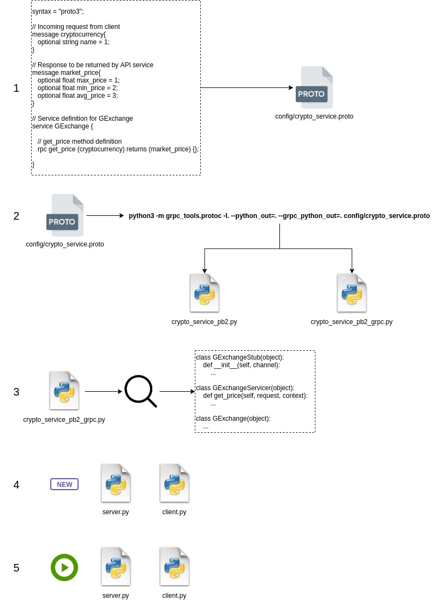

# poc-grpc-python-basic

Seguindo tutorial do [Link](https://speedscale.com/2022/02/17/using-grpc-with-python/)

## Fluxo


1. Instalar dependências do **requirements.txt**.
2. Criar arquivo **.proto**. (Exemplo: crypto_service.proto)
3. Colocar o contrato dentro do arquivo.
4. Executar no terminal o comando

``` shell
python3 -m grpc_tools.protoc -I. --python_out=. --grpc_python_out=. config/crypto_service.proto
```

Com isso, serão gerados dois arquivos:

- service_pb2.py
- service_pb2_grpc.py


Você não precisa alterar esses dois arquivos, eles já nascem prontos pelo plugin compilador do Python. Dentro do arquivo **service_pb2_grpc.py** haverá 3 classes:

- ...Stub
- ...Servicer
- ...

5. Em seguida, criar o arquivo servidor.
6. Dentro dele, implementar uma classe herdando da classe ...Servicer do arquivo **service_pb2_grpc.py**.
7. Essa classe deverá implementar os métodos definidos no arquivo .proto.
8. Em seguida, criar o arquivo cliente.
9. Dentro dele, implementar uma classe que possuirá um atributo **channel** e outro **stub**, no qual este se conectará com o gRPC.
10. Além disso, implementar um método (se possível, de mesmo nome) que irá montar uma *request* e chamar o método a partir do seu atributo *stub*.

### Para Executar
O servidor deverá estar de pé, para que assim o cliente possa chamá-lo.

Exemplo:

``` shell
python3 -m pasta.server
```
e, em seguida

``` shell
python3 -m pasta.client
```